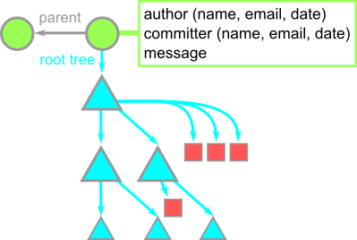

## Notes on Git

Önce bu notlarla başladık: [GitHub Kılavuzu](kılavuz)

Animation sonunda: [GitHub ile Takım Çalışması](takımlar)

Bu notlar commit-tree-blob üçlüsünü anlamak için ortak repomuzda bir çalışma:

```
 $ cat .git/HEAD  //where is the current HEAD?
ref: refs/heads/main
 $ cat .git/refs/heads/main
341c65d9ad219a108eb586174bc6bb5ee54a422c
 $ git cat-file -p 341c  //last commit
tree e8da9bb74a6127131c3140faf08b75506cd13e5f
parent 5c4e787d8094f4db5e2d9d5280d91499137855de
author M Akif Eyler <ma.eyler@gmail.com> 1608090059 +0300
committer M Akif Eyler <ma.eyler@gmail.com> 1608090059 +0300

write to the cloud
```



```
 $ git cat-file -p e8da  //root tree
100644 blob 9d132e9552b377be4f19fb5c00cfcbf5381141fd    .gitattributes
...
040000 tree ee3393d2d5e7fe3bcb30be537005775d01c11f31    anim
040000 tree ae30e72e4b3eb064869539d0d40cd3d437055e02    exam
...
 $ cat .git/refs/remotes/maeyler/main
a20f7b5d552aadf84be7ecbad2fd29822e910320
 $ git cat-file -p a20f  //earlier commit -- head of maeyler
tree 95144eeb3ecabe52e6386f003bb42cfd6c47737c
parent 75d31e894a18d9f72b55a0b70ba488a9f67173ea
parent 407861fc047e857b35596eb78bf4ad48533808f5
author M Akif Eyler <ma.eyler@gmail.com> 1607539197 +0300
committer M Akif Eyler <ma.eyler@gmail.com> 1607539208 +0300

Merge 'şeyma/main' into main

 $ git cat-file -p 9514  //root tree -- 6 commits earlier
100644 blob 9d132e9552b377be4f19fb5c00cfcbf5381141fd    .gitattributes
...
040000 tree cb584184b372169282018717bcdc3576e18074ea    anim
040000 tree ae30e72e4b3eb064869539d0d40cd3d437055e02    exam
...
 $ git cat-file -p ae30  //too short
error: short SHA1 ae30 is ambiguous
hint: The candidates are:
hint:   ae308a5 blob
hint:   ae30e72 tree
fatal: Not a valid object name ae30
 $ git cat-file -p ae30e  //exam tree
100644 blob 2060a2f05875b83d41ee1f3231011af01cf3ff84    Midterm 2019.html
...
100644 blob be06891f0b49ed119249238979dd1a2b29481e02    quiz_solution.md
100644 blob 9cbd9ebbd7fe2fadc68b7233551e1c1def5dc5e0    solution.txt
 $ git cat-file -p be06  //quiz_solution.md blob
### quiz_solution

### Sample Quiz


```

[Referans](https://github.blog/2020-12-17-commits-are-snapshots-not-diffs/)