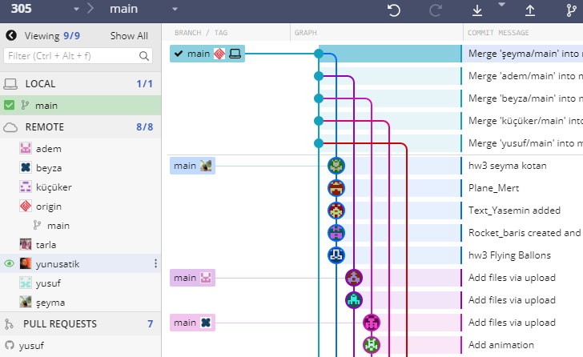
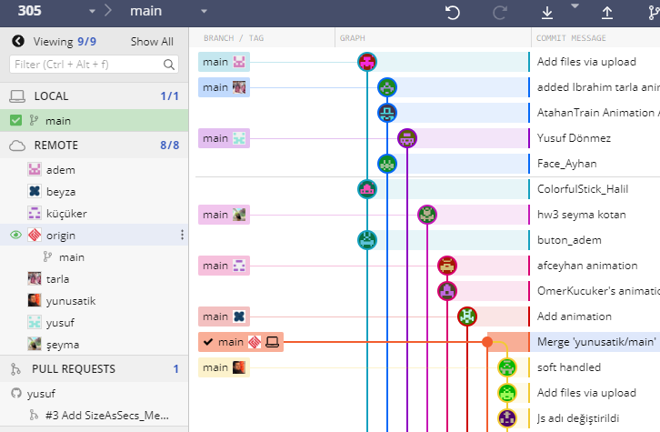
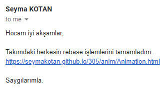

## GitHub ile Takım Çalışması

GitHub kullanmak için üç önemli sebep:
* Projeniz bir bütün olarak bulutta, her yerden erişilebilir
* Otomatik sürüm kontrolü ve koordineli takım çalışması 
* Programcılar için özgeçmişin önemli bir parçası

Git'in [akış ve dallanma mantığını](https://guides.github.com/introduction/flow/) 
şimdi daha iyi anlıyoruz


### GitKraken

Bu programın yararını özellikle Rebase işleminde ve grafiklerde gördük.

Yedi takım için yedi çatal yaptık, her takım kendi içinde çatallandı. 
Proje sonunda çatalları `Merge` ile bir araya getirdik:





Henüz bir takımın işi kabul edildiğinde yedi çatal böyle görünüyordu.


### Commit & Push

Yerel bilgisayarda denemeleri yapıp çalışır duruma getirince `Commit` işlemini 
yapıyoruz. Dokümanlardaki "Kaydet" gibi bir işlem, tek farkı, bütün ayrıntılar 
kaydedildiği için eski bir duruma dönmek mümkün.
Yerel cihazdaki commit'ler doğru çalıştıysa `Push` ile buluta (Remote) yazılır.

### Branch vs Fork

Yeni bir özellik denemek ya da takım çalışması yapmak için 
[dallanma](https://guides.github.com/introduction/flow) gerekiyor. 
Her dalı ayrı bir proje olarak düşünebiliriz.

Bu projede dallanmayı `branch` ile değil, GitHub'ın `Fork` komutu ile yaptık.

### Pull Request

Bir dal üstünde yeteri kadar çalışıp doğru işlediği görülünce, o dalın sahibi 
*Pull Request* yapıyor, projenin sahibi yeni özellikleri ya projeye ekliyor, 
ya da reddediyor. 



PR (bu mail gibi) sadece haber vermek için -- 
GitHub içindeki *Pull request* gerekli olmadı

### Merge vs Rebase

Takımların işini bir arada görmek için liderler `Rebase` kullandı. 
Böylece commit'ler tesbih tanesi gibi dizildi. 
Proje sonunda yedi dalı birleştirmek için Merge kullandık.
İki yaklaşımın avantajlarını görmüş olduk.


### Güncelleme

GitKraken ile çok kolay: 
Son commit üstünde Hard-reset ve ardından Push (force)

*Command line* içinde yerel klasör altında `git` komutuyla güncellemek için:
```
//clone your fork and define remote
git clone https://github.com/xxx/305
cd 305
git remote add blm https://github.com/BLM-FSMVU/305/

//update your fork (origin)
git fetch blm
git reset blm/main --hard
git push [--force]
```

### Teşekkürler

Takım liderlerine ve asistan hocalarınıza teşekkür ederim
