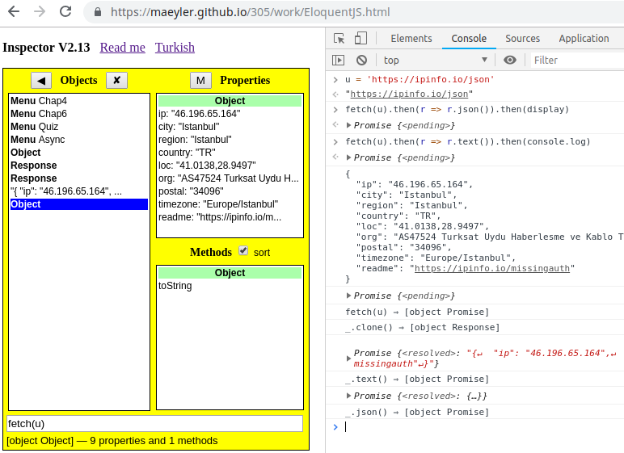
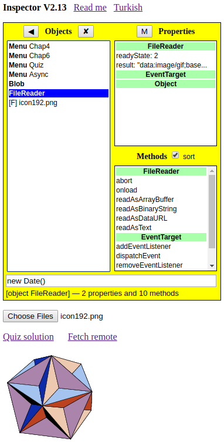

## Reading Files

JavaScript ile dosya okumak, bundan 5 yıl önce zor bir iş sayılırdı.

### Remote Text

Yakın zamanda çıkan fetch API ve Promise ile işler kolaylaştı:
```
u = 'https://ipinfo.io/json'
fetch(u).then(r => r.json()).then(display)
fetch(u).then(r => r.text()).then(console.log)
```
fetch() ile gelen Response üstünde sıra ile iki metodu çağırıyoruz. JSON nesnesi Inspector'da, düz metin (String) ise Console'da izleniyor.

Aynı işi Inspector'da yapmak daha da kolay:
```
fetch(u) ⇒ (input kutusuna yazılacak)
_.clone() ⇒ Response kopyası
_.text() ⇒ text olarak oku
_.json() ⇒ object olarak oku
```
fetch() ile gelen Response nesnesini kopyalayıp birinin text(), diğerinin json() metodunu çağırınca sonuçlar aynı yerde görünüyor.



### Local Text

Yerel dosyaları okumak için FileReader gerekiyor. Yukarıda verilen URL'yi açıp bir kopyasını masa üstüne alalım. "Choose Files" ile bu dosyayı seçelim. FileReader içinde result olarak aynı metine erişebiliriz. Metin seçili iken vereceğimiz `JSON.parse(_)` komutu ile metini nesneye çevirebiliriz.

### Local Image

Aynı şekilde seçilen resim dosyaları da yine FileReader ile okunur. Bununla ilgili birkaç komut Async menüsünde tanımlanmış. Onları da deneyelim.

### Remote Image

fetch() ile gelen bir resmi göstermek için aynı yazılımı kullanalım:
```
u = 'https://avatars1.githubusercontent.com/u/14038292'
fetch(u).then(r => r.blob()).then(display)
```
Bu şekilde yapılan Blob nesnesini nasıl okuyacağız? Önce "Choose Files" ile yerel bir resim dosyasını açalım. Böylece, FileReader resim okuma moduna girer. Şimdi önce içinde resim olan Blob nesnesine, sonra FileReader'a tıklayın ve readAsDataURL(__) metodunu çağırın. İşte okuduğumuz resim ekranda.



